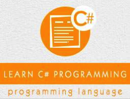

```
Roberto Nogueira  
BSd EE, MSd CE
Solution Integrator Experienced - Certified by Ericsson
```
# Tutorialspoint C# Tutorial



**About This Tutorial**

This is to grasp rapidly the language and its concepts.

[VBA Tutorial](https://www.tutorialspoint.com/csharp/index.htm)

#### Topics
```
C# Basic Tutorial
[ ] Home
[ ] Overview
[ ] Environment
[ ] Program Structure
[ ] Basic Syntax
[ ] Data Types
[ ] Type Conversion
[ ] Variables
[ ] Constants
[ ] Operators
[ ] Decision Making
[ ] Loops
[ ] Encapsulation
[ ] Methods
[ ] Nullables
[ ] Arrays
[ ] Strings
[ ] Structure
[ ] Enums
[ ] Classes
[ ] Inheritance
[ ] Polymorphism
[ ] Operator Overloading
[ ] Interfaces
[ ] Namespaces
[ ] Preprocessor Directives
[ ] Regular Expressions
[ ] Exception Handling
[ ] File I/O
C# Advanced Tutorial
[ ] Attributes
[ ] Reflection
[ ] Properties
[ ] Indexers
[ ] Delegates
[ ] Events
[ ] Collections
[ ] Generics
[ ] Anonymous Methods
[ ] Unsafe Codes
[ ] Multithreading
C# Useful Resources
[ ] Questions and Answers
[ ] Quick Guide
[ ] Useful Resources
[ ] Discussion
Selected Reading
[ ] Developer's Best Practices
[ ] Questions and Answers
[ ] Effective Resume Writing
[ ] HR Interview Questions
[ ] Computer Glossary
[ ] Who is Who
```

